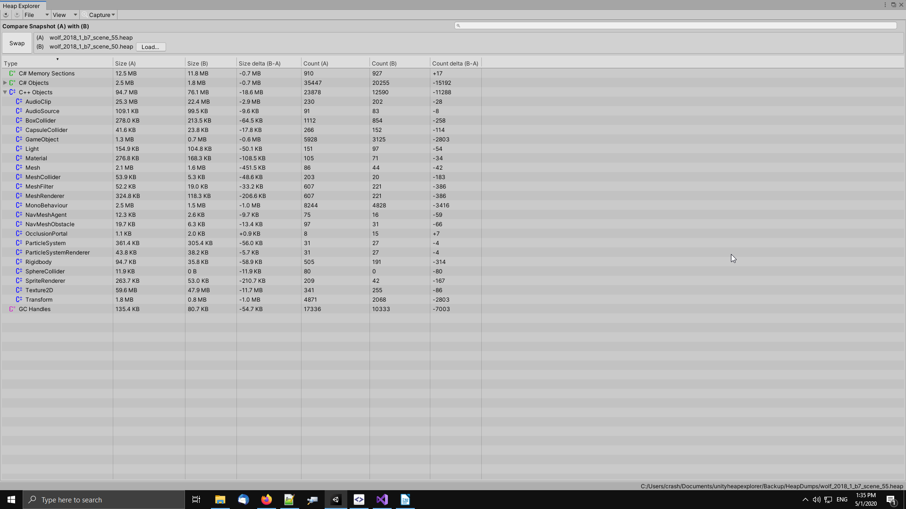

# Introduction

Heap Explorer is a Memory Profiler, Debugger and Analyzer for Unity. This repository hosts Heap Explorer for Unity 2019.3 and newer. For older versions, please visit the now obsolete repository on Bitbucket instead ([link](https://bitbucket.org/pschraut/unityheapexplorer/)).

I spent a significant amount of time identifying and fixing memory leaks, as well as looking for memory optimization opportunities in Unity applications in the past. During this time, I often used Unity's [old Memory Profiler](https://bitbucket.org/Unity-Technologies/memoryprofiler) and while it's an useful tool, I never was entirely happy with it.

This lead me to write my own memory profiler where I have the opportunity to make all the things I didn't like about Unity's Memory Profiler better.

# Installation

In order to use the Heap Explorer, you have to add the package to your project. As of Unity 2019.3, Unity supports to add packages from git through the Package Manager window.

In Unity's Package Manager, choose "Add package from git URL" and insert one of the Package URL's you can find below. Once Heap Explorer is installed, you can open it from Unity's main menu under "Window > Analysis > Heap Explorer".

## Package URL's

| Version  |     Link      |
|----------|---------------|
| 3.2.0 | https://github.com/pschraut/UnityHeapExplorer.git#3.2.0 |

# Target audience

Heap Explorer is a tool for programmers and people with a strong technical background, who are looking for a tool that helps them identifying memory issues and memory optimization opportunities in Unity applications.

Heap Explorer is not fixing memory leaks, nor optimizing content for you automatically. Heap Explorer is a tool where you have to understand the presented data and draw your own conclusions from.

# Contact

The easiest way to get in touch with me, if you already have an Unity forums account, is to post in the Heap Explorer forum thread:
https://forum.unity.com/threads/wip-heap-explorer-memory-profiler-debugger-and-analyzer-for-unity.527949/

You could also use the "Start a Conversation" functionality to send me a private message via the Unity forums: https://forum.unity.com/members/peter77.308146/

And last but not least, you can send me an email. Please find the contact information on my website:
http://www.console-dev.de

# Can I use this tool even when I work on a commercial project?

Yes, you can use Heap Explorer to debug, profile and analyze your hobby-, Indie- and commercial applications for free. You do not have to pay me anything.

If however Heap Explorer helped you, I would appreciate a mentioning in your credits screen. Something like "Heap Explorer by Peter Schraut" would be very much appreciated from my side, but is not required.
You can use Heap Explorer for free, without having to give me credit or mention you used the tool at all.

# How to capture a memory snapshot

Heap Explorer displays the connected Player in the "Capture" drop-down, which you can find in the toolbar. The button is located under a drop-down menu, to avoid clicking it by accident. 
If no Player is connected, Heap Explorer displays "Editor". Clicking the "Editor" button then captures a memory snapshot of the Unity editor.

If a Player is connected, Heap Explorer displays the Player name, rather than "Editor". It's the same name that appears in Unity's Profiler window as well.

| Item  |     Description      |
|----------|---------------|
| Capture and Save | Prompts for a save location before the memory snapshot is captured. This feature has been added to allow you  to quickly capture a memory snapshot that you can analyze later, without Heap Explorer analyzing the snapshot, which can be an expensive operation. |
| Capture and Analyze | Captures a memory snapshot and immediately analyzes it. |
| Open Profiler | Opens Unity's Profiler window. In order to connect to a certain target, you have to use Unity's Profiler. As you select a different target (Editor, WindowsPlayer, ...) in Unity's Profiler window, Heap Explorer will update its entry in the "Capture" drop-down accordingly, depending on what is selected in Unity's Profiler. |

# Brief Overview

The Brief Overview page shows the most important "quick info" in a simple to read fashion, such as the top 20 object types that consume the most memory.

# Compare Memory Snapshots

Heap Explorer supports to compare two memory snapshots and show the difference between those. This is an useful tool to find memory leaks.

"A" and "B" represent two different memory snapshots.

The "delta" columns indicate changes. The "C# Objects" and "C++ Objects" nodes can be expanded to see which objects specifically cause the difference.

Snapshot "A" is always the one you loaded using "File > Open Snapshot" or captured. While "B" is the memory snapshot that is used for comparison and can be replaced using the "Load..." button in the Compare Snapshot view.

